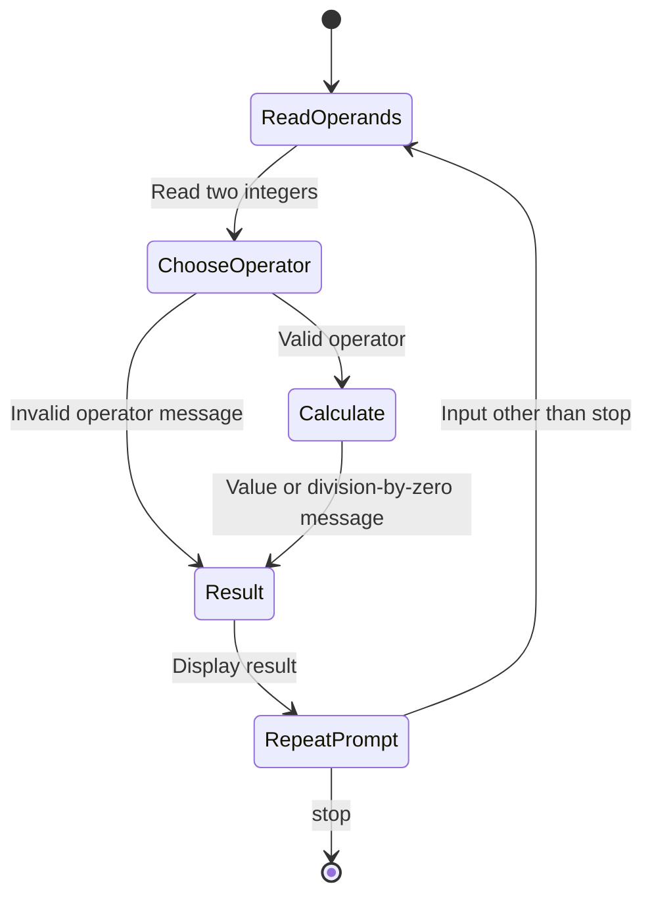

# DEPI Python Assignments

A collection of introductory Python exercises and small interactive programs completed during the Digital Egypt Pioneers Initiative.

**Technology:** Python · Jupyter Notebook

## Features

- Practice functions, conditionals, loops, strings, lists, tuples, and dictionaries.
- Implement vowel counting, maximum selection, tuple addition, and a number-guessing game.
- Build an interactive calculator with division-by-zero handling.
- Explore comprehensions, factorials, character counts, slicing, and simple patterns.

## Repository guide

| Path | Purpose |
|---|---|
| [Assignment-1-a.ipynb](Assignment-1-a.ipynb) | Vowel counting and finding a list maximum. |
| [Assignment-1-b.ipynb](Assignment-1-b.ipynb) | Functions, tuple sums, guessing game, and word-index dictionaries. |
| [mini_project_1.ipynb](mini_project_1.ipynb) | Repeating two-number calculator. |
| [workshop_2.ipynb](workshop_2.ipynb) | Python fundamentals practice. |

## Requirements and current limitations

Run cells individually in Jupyter; several exercises use `input()` and wait for a response. The notebooks record learning exercises, so prompt requirements and implementations may differ in places. No external dataset or trained model is required for these exercises.

## UML diagrams

### Calculator exercise states

This UML state diagram summarizes the interactive calculator exercise, one of the repository's foundational Python assignments.



## Getting started

```bash
git clone https://github.com/IbrahimAbdelsattar/Data-Science-Assignments.DEPI.git
cd Data-Science-Assignments.DEPI
```

Use a Python virtual environment:

```bash
python -m venv .venv
```

Activate it with `source .venv/bin/activate` on macOS/Linux or `.venv\Scripts\Activate.ps1` in PowerShell.

```bash
python -m pip install jupyter
python -m jupyter notebook
```

Open the notebook listed above and run its cells in order. Adjust dataset and model paths as described in the limitations section.
